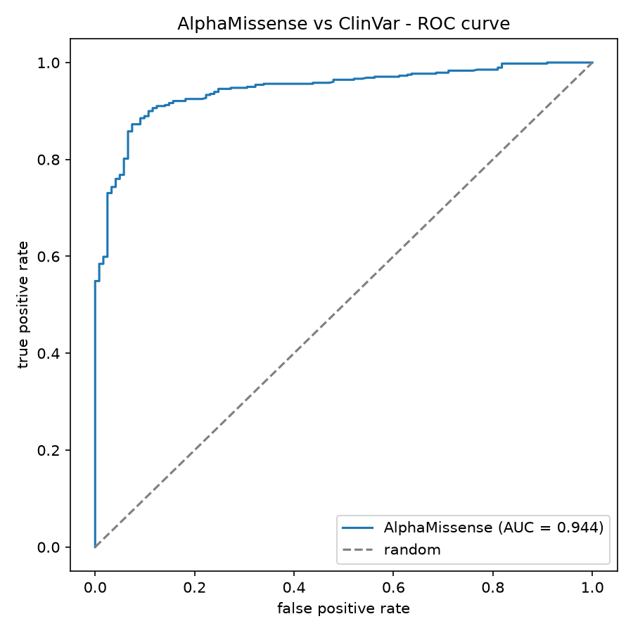

# AlphaMissense vs ClinVar — a variant-pathogenicity benchmark

How good is **AlphaMissense** (DeepMind's missense-variant pathogenicity model)
at telling pathogenic variants from benign ones? Here we treat **ClinVar**
clinical labels as ground truth and benchmark AlphaMissense against them.

## Headline finding

AlphaMissense is strong overall (**ROC-AUC 0.944**)  **but it missed a critical
mutation.** The most common Niemann-Pick disease type C1 mutation, **NPC1 I1061T**
(written *I1063T* in some papers), is **definitively pathogenic in ClinVar**
(multiple independent submissions), yet AlphaMissense scores it **0.303 and calls
it benign**. A famous, disease-causing variant, classified wrong.

That single example is the point of the whole project: an aggregate metric can
look excellent while the model still fails on individual, clinically important
variants — so you benchmark against ground truth instead of trusting a score.

## Results

| Metric | Value |
|---|---|
| ROC-AUC (AlphaMissense score vs ClinVar label) | **0.944** |
| Average precision | 0.986 |
| Agreement of AlphaMissense's own P/B call with ClinVar | 0.850 |
| Definite-label missense variants benchmarked | 600 (479 pathogenic, 121 benign) |



## How it works

1. `fetch_variants.py` pulls variants for a panel of disease genes (NPC1, NPC2,
   BRCA1/2, TP53, MLH1, MSH2, PTEN, LDLR, CFTR) from **MyVariant.info**, which
   carries both the AlphaMissense score (via dbNSFP) and the ClinVar label in one
   place. Saved to `data/variants.csv`.
2. `benchmark.py` keeps only variants with a definite ClinVar label (pathogenic or
   benign) and a numeric AlphaMissense score, then computes ROC-AUC / average
   precision, checks AlphaMissense's own class calls, saves the ROC curve, and
   prints the NPC1 spotlight.
3. `alphamissense_walkthrough.ipynb` walks through the same analysis cell by cell.

## Run it

```bash
pip install -r requirements.txt
python fetch_variants.py     # builds data/variants.csv (public data, no key needed)
python benchmark.py          # prints metrics + writes results/roc_curve.png
```

Or open `alphamissense_walkthrough.ipynb` to step through it.

## Honest caveats

- **Class imbalance** (479 pathogenic vs 121 benign) inflates average precision —
  ROC-AUC is the more reliable summary here
- **Circularity:** AlphaMissense was partly calibrated on ClinVar-like data, so
  benchmarking *on* ClinVar can be optimistic.
- **Sample size:** 600 definite-label missense variants across 10 genes — a demo
  scale; a fuller study would use more genes or add gnomAD common variants as a
  benign set.

## Files

- `fetch_variants.py` — pull AM score + ClinVar label from MyVariant.info
- `benchmark.py` — metrics + ROC curve + NPC1 spotlight
- `alphamissense_walkthrough.ipynb` — step-by-step notebook
- `data/variants.csv` — the fetched variants (public data)
- `results/roc_curve.png` — the ROC curve
