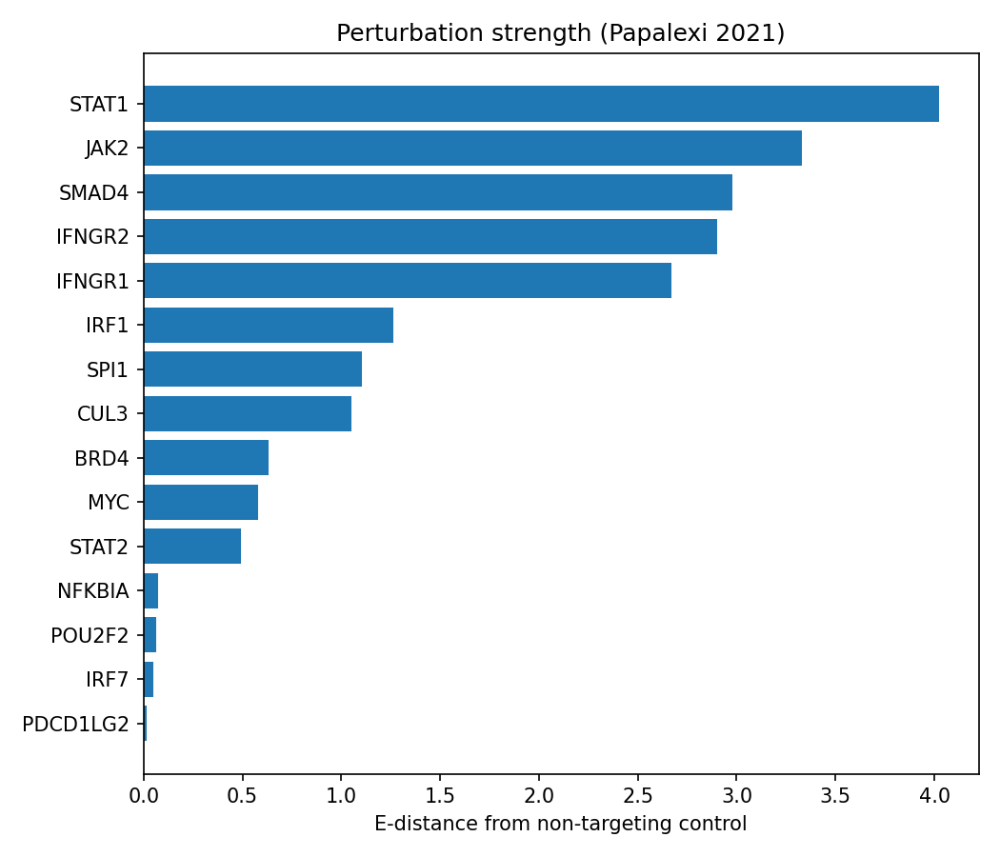

# Perturb-seq analysis — Papalexi 2021 CRISPR screen

A single-cell CRISPR-screen (Perturb-seq / ECCITE-seq) analysis with **pertpy**:
which cells actually respond to a perturbation, and which perturbations have the
strongest effect.

## Dataset

Papalexi et al., *"Characterizing the molecular regulation of inhibitory immune
checkpoints with multimodal single-cell screens,"* **Nature Genetics 2021**
(GEO **GSE153056**). Publicly available and loaded with one line via `pertpy`
(no key needed). ~20,700 cells, 26 gene targets, multimodal (RNA + protein +
hashing + CRISPR guides).

## What it does

1. **Load + label** — take the RNA modality and attach the perturbation labels.
2. **Preprocess** — normalize, log, highly-variable genes, scale, PCA.
3. **Mixscape** — compute a perturbation signature (subtract each cell's nearest
   control neighbours), then classify guide-carrying cells into **KO** (true
   knockout phenotype) vs **NP** (escapers that carry a guide but look
   unperturbed).
4. **E-distance** — quantify how far each perturbation sits from the
   non-targeting control in expression space (effect size), and rank them.

## Results

**Mixscape — most guide-carrying cells are escapers:**

| class | cells |
|---|---|
| NP (escapers) | 16,467 |
| KO (true knockout) | 1,876 |
| NT (control) | 2,386 |

Only ~10% of guide-carrying cells show a true knockout phenotype — a key quality
check for any Perturb-seq screen (a guide in a cell is not the same as a
functional knockout).

**E-distance — strongest perturbations recover the known pathway:**



The top hits — **STAT1, JAK2, SMAD4, IFNGR1/2, IRF1** — are the **IFN-γ /
JAK-STAT signaling pathway**, exactly the biology this immune-checkpoint screen
was designed to probe. The analysis recovered the pathway directly from the data.

## Run it

```bash
pip install -r requirements.txt
python perturbseq_pipeline.py     # runs the full pipeline, writes results/perturbation_strength.png
```

## Notes

- Mixscape "escaper" rates are expected in CRISPR screens (incomplete editing,
  functional buffering) — quantifying them is the point.
- E-distance is computed on PCA space; a permutation test (`pertpy` `DistanceTest`)
  would add significance values — a natural next step.

## Files

- `perturbseq_pipeline.py` — full pipeline (script)
- `results/perturbation_strength.png` — ranked perturbation effect sizes
