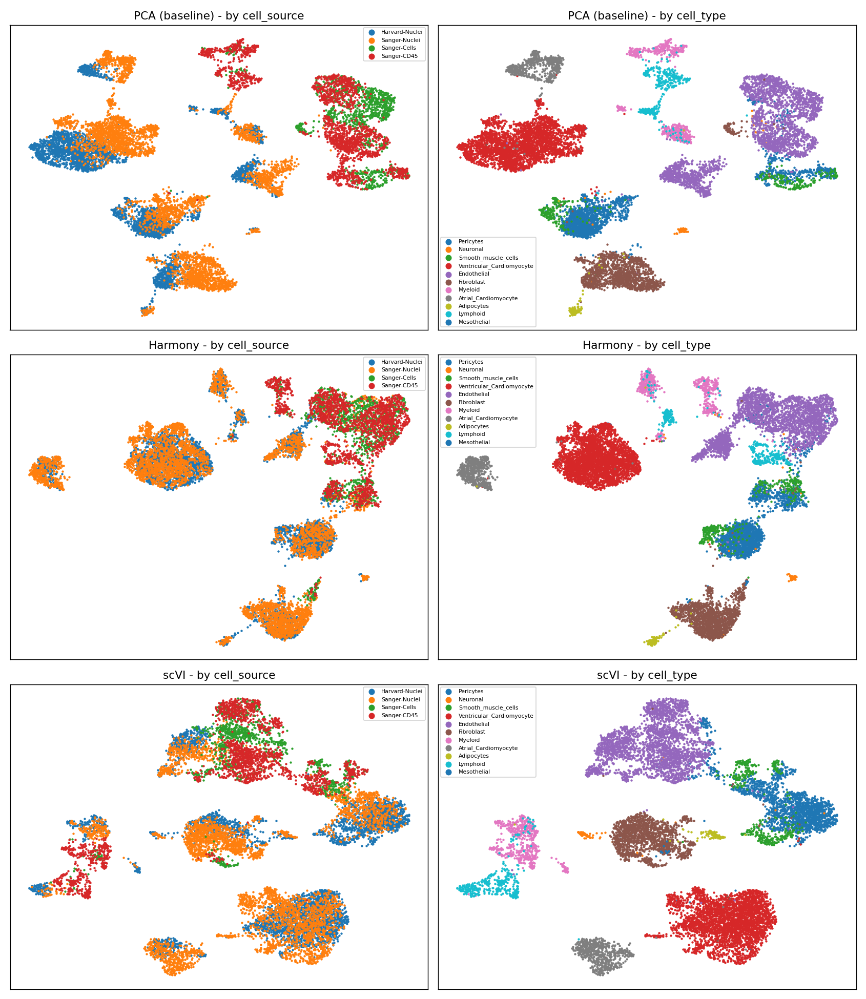
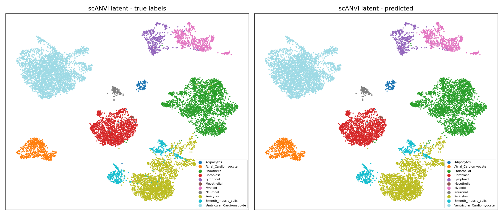

# Batch integration benchmark — Harmony vs scVI

Single-cell RNA-seq batch correction on the heart cell atlas, comparing two
integration methods against a plain-PCA baseline:

- **Harmony** — a fast, linear correction of an existing PCA embedding.
- **scVI** — a deep generative model (`scvi-tools`, PyTorch) that learns a latent
  space directly from raw counts, conditioned on the batch.

The atlas profiles the same cell types with four isolation protocols
(`cell_source`: Harvard-Nuclei, Sanger-Nuclei, Sanger-Cells, Sanger-CD45). Nuclei
vs whole-cell vs sorted differ strongly, creating a technical **batch effect**.

## Result

| Method | batch mixing (higher/better) | cell-type silhouette (higher/better) |
|---|---|---|
| PCA (baseline) | 0.212 | 0.151 |
| Harmony | **0.382** | 0.171 |
| scVI | 0.343 | **0.260** |

A clear trade-off: **Harmony mixes the batches most aggressively**, while **scVI
gives the cleaner biological representation** (much higher cell-type structure).
Both beat raw PCA.



Rows = PCA, Harmony, scVI; columns coloured by protocol (batch) and by cell type.
PCA splits cells by protocol; Harmony mixes them but leaves looser cell-type
clusters; scVI mixes them and forms tight cell-type clusters.

**Nuance:** the CD45-sorted cells stay somewhat separate even after integration -
correctly, because CD45 sorting enriches immune cells, so that difference is
biological, not a technical batch.

## Cell typing with scANVI

scVI gave the cleanest biology, so we annotate cells on top of it with **scANVI**
(its semi-supervised extension). As an honest test we hide 30% of the labels,
train on the rest, and predict the hidden cells.

**Accuracy on the held-out cells: 0.98** (macro-F1 0.94). Near-perfect on the
abundant, distinct types (cardiomyocytes, endothelial, fibroblast); the errors
concentrate on rare types (e.g. Mesothelial, n=4) and genuinely similar ones
(smooth muscle vs pericytes) - a sensible failure pattern.



The scANVI-latent UMAP coloured by true vs predicted labels: the two panels are
near-identical, which is the 98% accuracy made visual.

## How it works

1. Load the heart atlas (auto-downloaded), subsample for CPU speed, keep raw
   counts (scVI models counts directly).
2. Baseline: normalize, log, HVG, PCA.
3. Harmony corrects the PCA; scVI trains on the counts with `batch_key`.
4. Score each with a kNN batch-mixing entropy and a cell-type silhouette, plot UMAPs.
5. scANVI (built on the scVI model) transfers labels to held-out cells.

## Run it

```bash
pip install -r requirements.txt
python scvi_pipeline.py       # integration benchmark -> results/integration_comparison.png
python scanvi_celltyping.py   # scANVI cell typing   -> results/scanvi_celltyping.png
```

Runs on CPU in a few minutes each (12k cells).

## Files

- `scvi_pipeline.py` — integration benchmark (PCA / Harmony / scVI)
- `scanvi_celltyping.py` — scANVI label transfer
- `scvi_walkthrough.ipynb` — step-by-step notebook (benchmark + cell typing)
- `results/integration_comparison.png` — integration comparison
- `results/scanvi_celltyping.png` — true vs predicted cell types
